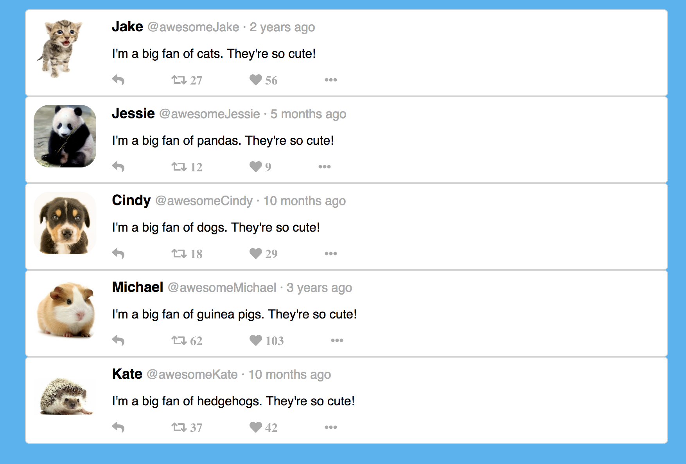

## Tweet Project

Tweet Project is built with [Create React App]. It displays tweet cards. 

It is a project for myself to practice using 'Props'.

## Project Screenshot

## Instructions for installment

* clone my repo `https://github.com/mavisluan/tweet`
* install all project dependencies with `npm install`
* start the development server with `npm start`

